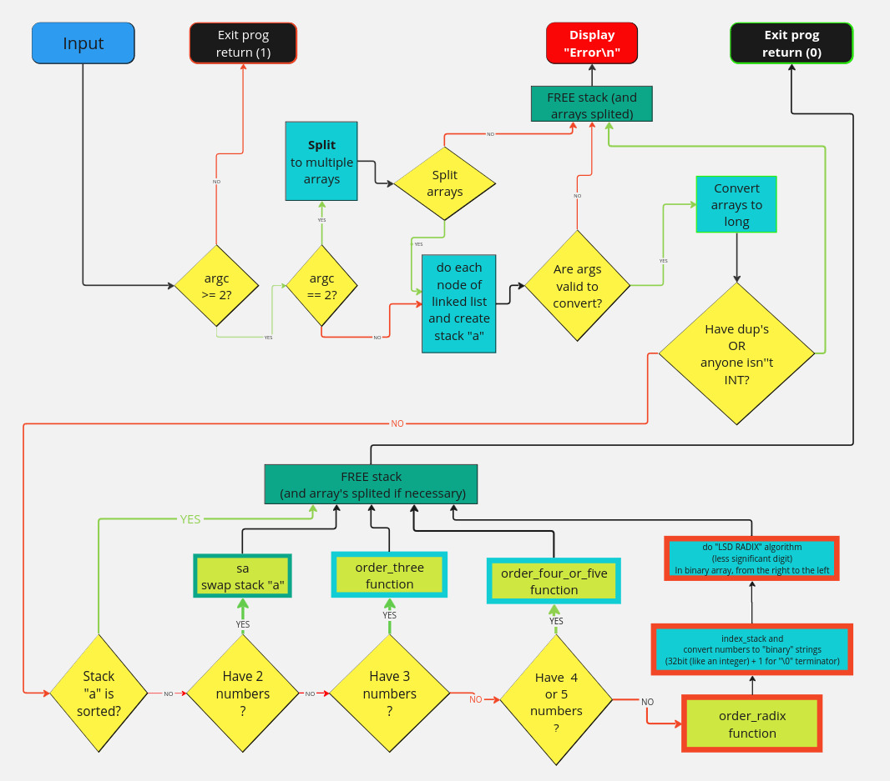

# Push_swap



## Overview
This project is about sorting data on a stack with a limited set of instructions, trying to achieve the lowest possible number of actions. It was a great opportunity to learn about sorting algorithms and optimize their efficiency.

## How it Works
The program sorts a random list of integers using two stacks (a and b) and a specific set of instructions:

- `sa` (swap a): Swap the first 2 elements of stack a
- `sb` (swap b): Swap the first 2 elements of stack b
- `ss`: Do `sa` and `sb` at the same time
- `pa` (push a): Take the first element from b and put it at the top of a
- `pb` (push b): Take the first element from a and put it at the top of b
- `ra` (rotate a): Shift up all elements of stack a by 1
- `rb` (rotate b): Shift up all elements of stack b by 1
- `rr`: Do `ra` and `rb` at the same time
- `rra` (reverse rotate a): Shift down all elements of stack a by 1
- `rrb` (reverse rotate b): Shift down all elements of stack b by 1
- `rrr`: Do `rra` and `rrb` at the same time

## Implementation

### My Approach
I implemented a Radix sort algorithm using a binary representation:
1. Convert each integer to a 32-bit binary string
2. Sort the stack by processing one bit at a time
3. For each bit position, move all numbers with '0' at that position to stack B, then move them back (with some optimizations)
4. Continue until all bit positions are processed

This approach is efficient for larger datasets and meets the required operation limits:
- For 100 random numbers: around ~950 operations
- For 500 random numbers: around ~5720 operations

### Special Cases
For small stacks, I used optimized sorting:
- 2 numbers: Simple swap if needed
- 3 numbers: Custom 3-number sort algorithm
- 4-5 numbers: Custom sorting algorithm

## Learning Outcomes
This project was particularly valuable for me to:
- Better understand how linked lists work in practice
- Learn about the implementation and optimization of sorting algorithms
- Practice memory management and efficient code design
- Understand the concept of complexity in algorithms
- Visualize program flow and decision logic (as shown in the diagram)

## Usage
```
./push_swap 4 67 3 87 23
```
This will print out the series of operations needed to sort these numbers.

To check if the operations work correctly:
```
ARG="4 67 3 87 23"; ./push_swap $ARG | ./checker_linux $ARG
```
If sorted correctly, this will display "OK".

## Program Flow
The flow diagram included at the top of this README illustrates the program's execution logic:

1. The program first validates inputs and creates the stack
2. It checks for error conditions (duplicates, non-integers, etc.)
3. Based on the stack size, it chooses the appropriate sorting algorithm:
   - 2 numbers: Simple swap
   - 3 numbers: Custom three-number sorting algorithm
   - 4-5 numbers: Specialized algorithm for these small sets
   - Larger sets: Radix sort algorithm

The highlighted sections in the diagram show the key components of the radix sort implementation, including:
- Converting numbers to 32-bit binary strings (with an extra terminating character)
- Sorting by processing bits from right to left (least to most significant)

## Checker Program for testing
The checker program is included in the push_swap directory. It validates that a sequence of operations correctly sorts a given stack. It works by:

1. Taking the same initial stack as input
2. Reading and executing instructions from standard input
3. Verifying if the stack is properly sorted after all operations
4. Displaying "OK" if sorted or "KO" if not sorted correctly
